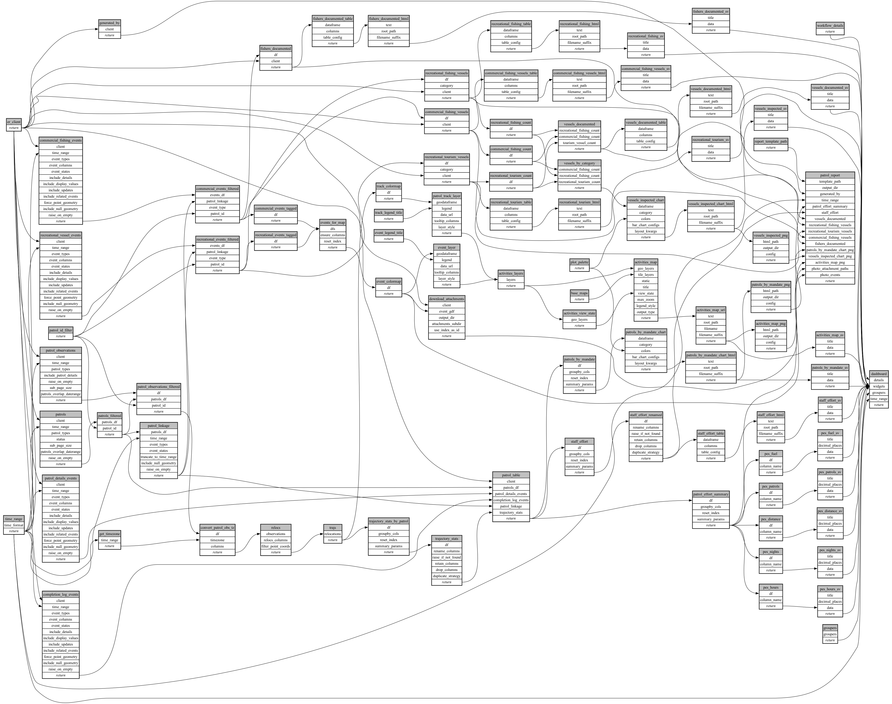

```
# AUTOGENERATED BY ECOSCOPE-WORKFLOWS; see fingerprint in README.md for details

```

```yaml
# fingerprint:
artifacts_sha256_basic: 687ad3bd24bf1db666595b0b4f534fb391f01bcf67c52546466dd5026c1d8863
artifacts_sha256_strict: 66b6c5784684fe74023a9ba5cd860bf685b1f29cb7be5995e12b2da519ee8b37
installed_requirements:
- channel: https://repo.prefix.dev/ecoscope-workflows/
  name: ecoscope-platform
  version: {version: ==2.25.0}
- channel: https://repo.prefix.dev/ecoscope-workflows-custom/
  name: ecoscope-workflows-ext-custom
  version: {version: ==0.1.1}
- channel: conda-forge
  name: pydeck
  version: {version: ==0.9.2}
- channel: https://repo.prefix.dev/ecoscope-workflows-custom/
  name: ecoscope-workflows-ext-belize
  version: {version: ==0.0.1}
params_sha256: 5fb283a5b7694af145322359ed9b62eba85403ba37771a91aa8c7b030767b085
spec_sha256: f436fc94eee4c67ad34e5efc939c10b0c6328ebd52ef0226e9b6ec444300dac8

```

# ecoscope-workflows-belize-patrol-report-workflow


