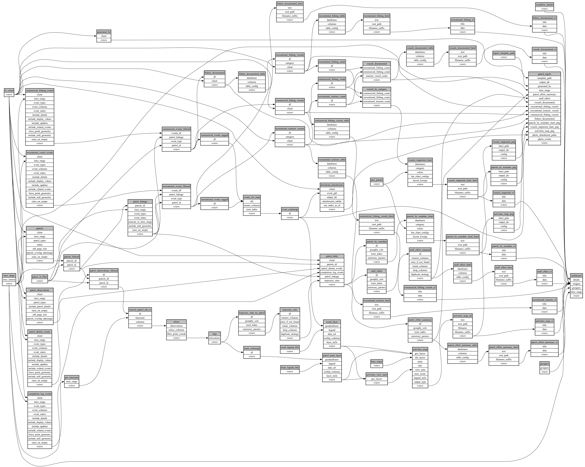

```
# AUTOGENERATED BY ECOSCOPE-WORKFLOWS; see fingerprint in README.md for details

```

```yaml
# fingerprint:
artifacts_sha256_basic: 5b779aeeb58d7e5f1680cac3c671378fbbd8a605b7806d49d64c8cdbe2b14b8c
artifacts_sha256_strict: b5ec4c32ebddcd20a92bf438f73d3126764a5cbe5b07ff6efd394a15611621aa
installed_requirements:
- channel: https://repo.prefix.dev/ecoscope-workflows/
  name: ecoscope-platform
  version: {version: ==2.25.1}
- channel: https://repo.prefix.dev/ecoscope-workflows-custom/
  name: ecoscope-workflows-ext-custom
  version: {version: ==0.1.1}
- channel: conda-forge
  name: pydeck
  version: {version: ==0.9.2}
- channel: https://repo.prefix.dev/ecoscope-workflows-custom/
  name: ecoscope-workflows-ext-belize
  version: {version: ==0.0.2}
params_sha256: 5fb283a5b7694af145322359ed9b62eba85403ba37771a91aa8c7b030767b085
spec_sha256: 53d731ab5adf9e8bae6938faa94c0c896f07ab5df43b4d2901aa48533b5754ff

```

# ecoscope-workflows-belize-patrol-report-workflow


